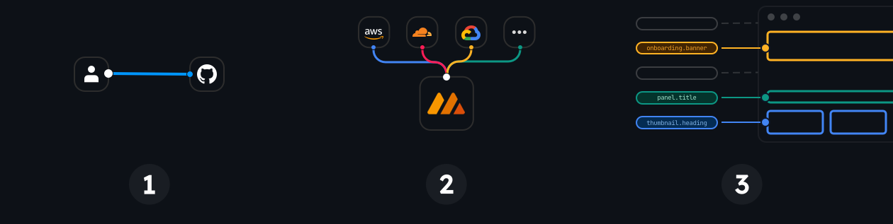

[](https://messagevisor.com)

<div align="center">
  <h3><strong>Git-native i18n and l10n management solution</strong></h3>
</div>

<div align="center">
  <small>Manage your application copy, translations, and formatting declaratively from the comfort of your Git workflow.</small>
</div>

<div align="center">
  <h3>
    <a href="https://messagevisor.com">
      Website
    </a>
    <span> | </span>
    <a href="https://messagevisor.com/docs/quick-start">
      Documentation
    </a>
    <span> | </span>
    <a href="https://github.com/messagevisor/messagevisor/issues">
      Issues
    </a>
    <span> | </span>
    <a href="https://messagevisor.com/docs/contributing">
      Contributing
    </a>
    <span> | </span>
    <a href="https://github.com/messagevisor/messagevisor/blob/main/CHANGELOG.md">
      Changelog
    </a>
  </h3>
</div>

<div align="center">
  <sub>Built by
  <a href="https://twitter.com/fahad19">@fahad19</a></sub>
</div>

---

## How does it work?

Messagevisor lets teams manage application copy, translations, and locale behavior as source code:

1. Manage a Messagevisor [project](https://messagevisor.com/docs/projects) in Git.
1. Author messages, locales, targets, overrides, segments, tests, and examples as YAML or JSON.
1. Validate everything with the CLI.
1. Build compact target and locale-specific [datafiles](https://messagevisor.com/docs/building-datafiles).
1. Serve those JSON datafiles from a CDN or application server.
1. Evaluate translations, formatting, and conditional copy with the [SDK](https://messagevisor.com/docs/sdks/javascript).

[](https://messagevisor.com)

## Why Messagevisor?

- **Translations as code:** review copy changes in pull requests with the same workflow as application code.
- **Targeted datafiles:** ship only the messages, locales, formats, metadata, and override logic each app needs.
- **Runtime conditions:** define attributes, segments, and ordered overrides for plan, platform, country, feature flag, experiment, and audience-specific copy.
- **Locale inheritance:** share translations and format presets across language and regional variants.
- **Portable formatting:** define named number, date, time, relative, and range presets that SDKs can consume consistently.
- **Review UI:** generate the Catalog to inspect messages, locales, targets, examples, relationships, Git history, and optional reports.
- **Release lanes:** use sets and promotion flows for dev, staging, production, or parallel localization streams.

## Quick start

```bash
npx messagevisor init
npm install

npx messagevisor lint
npx messagevisor build
npx messagevisor catalog
```

Read the full [Quick start](https://messagevisor.com/docs/quick-start) when you are ready to wire a generated datafile into an application.

## Core concepts

| Concept                                                | Purpose                                                                                                            |
| ------------------------------------------------------ | ------------------------------------------------------------------------------------------------------------------ |
| [Messages](https://messagevisor.com/docs/messages)     | Translation keys, base translations, overrides, examples, metadata, deprecation, and archival                      |
| [Locales](https://messagevisor.com/docs/locales)       | Language and regional variants, direction, inheritance, formats, and locale examples                               |
| [Targets](https://messagevisor.com/docs/targets)       | Per-application datafile definitions with message inclusion, locales, context, output options, and format overlays |
| [Attributes](https://messagevisor.com/docs/attributes) | Runtime context fields used by conditions                                                                          |
| [Segments](https://messagevisor.com/docs/segments)     | Reusable condition trees for audiences                                                                             |
| [Overrides](https://messagevisor.com/docs/overrides)   | Ordered conditional translation branches, first match wins                                                         |
| [Tests](https://messagevisor.com/docs/testing)         | Assertions for messages, locales, segments, and targets                                                            |
| [Sets](https://messagevisor.com/docs/sets)             | Independent project trees for environments, release lanes, and promotions                                          |
| [Catalog](https://messagevisor.com/docs/catalog)       | Static review UI generated from a Messagevisor project                                                             |

## CLI overview

Run commands inside a Messagevisor project:

```bash
npx messagevisor <command> [options]
```

| Command             | Use                                                               |
| ------------------- | ----------------------------------------------------------------- |
| `init`              | Create a starter project                                          |
| `config`            | Print resolved project configuration                              |
| `info`              | Show entity counts                                                |
| `lint`              | Validate project definitions                                      |
| `list`              | Query messages, locales, targets, attributes, segments, and tests |
| `evaluate`          | Debug one message, raw ICU string, or segment quickly             |
| `examples`          | Resolve authored message and locale examples                      |
| `test`              | Run Messagevisor test specs                                       |
| `build`             | Generate datafiles                                                |
| `catalog`           | Build, serve, and watch the Catalog in dev mode                   |
| `export` / `import` | Exchange translations through CSV or JSON                         |
| `find-duplicates`   | Find duplicate resolved translation values                        |
| `find-usage`        | Find authored entity and format references                        |
| `prune`             | Remove redundant inherited translations or formats                |
| `promote`           | Move changes between sets                                         |
| `generate-code`     | Generate typed TypeScript helpers from message keys               |

See the [CLI docs](https://messagevisor.com/docs/cli) for all options. The fastest correctness loop while authoring is usually:

```bash
npx messagevisor lint
npx messagevisor evaluate --message=<key> --locale=<locale> --target=<target>
npx messagevisor test --keyPattern=<key>
```

## Catalog

Catalog is a generated, read-only website for reviewing a Messagevisor project:

```bash
npx messagevisor catalog
npx messagevisor catalog export
npx messagevisor catalog serve
npx messagevisor catalog --set=staging --set=production
```

Translation-value search and duplicate reports are opt-in because they can be expensive in large projects:

```bash
npx messagevisor catalog --with-translation-search
npx messagevisor catalog --with-duplicates
npx messagevisor catalog export --with-translation-search --with-duplicates
```

`catalog serve` only serves already generated output. It does not build optional search or duplicate indexes.

For sets-based projects, catalog generation includes all sets by default. Pass `--set=<name>` one or more times to generate only selected sets.

## Example projects

This monorepo includes focused projects under [`projects/`](./projects):

| Project                                                   | Focus                                                                                |
| --------------------------------------------------------- | ------------------------------------------------------------------------------------ |
| [`project-1`](./projects/project-1)                       | Broad YAML example with ICU, overrides, targets, tests, examples, and format presets |
| [`project-demo`](./projects/project-demo)                 | Sets-based ecommerce demo                                                            |
| [`project-sets`](./projects/project-sets)                 | Minimal sets workflow                                                                |
| [`project-environments`](./projects/project-environments) | Environment-style sets starter                                                       |
| [`project-test-envs`](./projects/project-test-envs)       | Test environments as sets                                                            |
| [`project-json`](./projects/project-json)                 | JSON authoring                                                                       |
| [`project-yml`](./projects/project-yml)                   | Minimal YAML authoring                                                               |
| [`project-rtl`](./projects/project-rtl)                   | RTL locale review and rendering                                                      |
| [`project-raw`](./projects/project-raw)                   | Runtime without the ICU module                                                       |

Try one:

```bash
npx @messagevisor/cli init --project=environments
npm install

npx messagevisor info
npx messagevisor test
npx messagevisor catalog
```

## Packages

| Package                                                                               | Purpose                                                                                     |
| ------------------------------------------------------------------------------------- | ------------------------------------------------------------------------------------------- |
| [`@messagevisor/cli`](./packages/cli)                                                 | CLI entrypoint                                                                              |
| [`@messagevisor/core`](./packages/core)                                               | Core project loading, linting, building, testing, import/export, promotion, and CLI plugins |
| [`@messagevisor/sdk`](./packages/sdk)                                                 | JavaScript runtime SDK for Node.js and browsers                                             |
| [`@messagevisor/react`](./packages/react)                                             | React bindings                                                                              |
| [`@messagevisor/vue`](./packages/vue)                                                 | Vue bindings                                                                                |
| [`@messagevisor/react-intl-compat`](./packages/react-intl-compat)                     | Compatibility layer for react-intl style APIs                                               |
| [`@messagevisor/catalog`](./packages/catalog)                                         | Static Catalog generator and UI                                                             |
| [`@messagevisor/module-icu`](./packages/module-icu)                                   | ICU message formatting module                                                               |
| [`@messagevisor/module-interpolation`](./packages/module-interpolation)               | Lightweight string interpolation module                                                     |
| [`@messagevisor/module-featurevisor`](./packages/module-featurevisor)                 | Featurevisor feature and experiment condition integration                                   |
| [`@messagevisor/module-missing-translations`](./packages/module-missing-translations) | Missing translation reporting module                                                        |
| [`@messagevisor/types`](./packages/types)                                             | Shared TypeScript declarations                                                              |

## SDK usage

Applications consume built datafiles, not source YAML or JSON files:

```ts
import { createMessagevisor } from "@messagevisor/sdk";
import { createIcuModule } from "@messagevisor/module-icu";
import datafile from "./datafiles/messagevisor-web-en-US.json";

const m = createMessagevisor({
  datafile,
  modules: [createIcuModule()],
});

m.translate("auth.signin");
m.translate("dashboard.welcome", { name: "Ada" });
```

See the [SDK docs](https://messagevisor.com/docs/sdks) for JavaScript, React, Vue, browser, Node.js, React Native, and react-intl compatibility usage.

## Agent skills

Messagevisor ships an agent skill in [`skills/messagevisor`](./skills/messagevisor). It helps AI coding agents understand the project model, choose safe commands, author translations, run `evaluate`, write tests, use Catalog, and avoid editing generated output as source.

Install it with:

```bash
npx skills add messagevisor/messagevisor
```

See [`skills/README.md`](./skills/README.md) for details.

## Contributing

Install dependencies at the monorepo root:

```bash
npm install
```

Useful checks:

```bash
npm run typecheck
npm run test
npm run build
```

Targeted package checks:

```bash
npm run test --workspace @messagevisor/core
npm run test --workspace @messagevisor/catalog
npm run build --workspace @messagevisor/catalog
```

Read the [Contributing docs](https://messagevisor.com/docs/contributing) for project conventions and release workflow.

## License

MIT © [Fahad Heylaal](https://fahad19.com)
